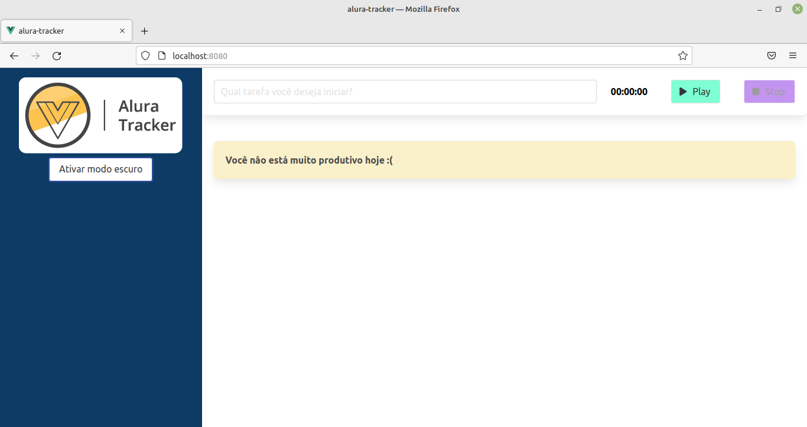

<h1 align="center">
  
</h1>

<h2 align="center">:clock130: Alura Tracker</h2>
<p> 
  O <strong>Alura Tracker</strong> é uma aplicação Web com a finalidade de registrar o tempo gasto em cada atividade realizada, de modo que você possa analisar sua produtividade.
  
  O Projeto foi desenvolvido durante o curso <strong>Vue3: explorando o framework</strong> da [Alura](https://alura.com.br/).
</p>

## :dart: Índice
- [Status](#status)
- [Layout](#layout)
- [Tecnologias](#tecnologias)
- [Pré-Requisitos](#pre-requisitos)
- [Executando o projeto](#executando-o-projeto)
- [Licença](#licença)
- [Contato](#contato)

## :game_die: Status
<p align="center">
  
  
  
  
</p>

## :framed_picture: Layout



## :toolbox: Tecnologias
- [Node.js](https://nodejs.org/)
- [Vue.js](https://vuejs.org/)

## :heavy_check_mark: Pré-requisitos
Antes de iniciar, certifique-se que tenha instalado em seu computador as seguintes ferramentas:
- [Node.js](https://nodejs.org/)
- [Git](https://git-scm.com/downloads)

## :gear: Executando o projeto

1. *Faça o clone do repositório:*

```sh
$ git clone https://github.com/LuizEduardoBilotta/alura-tracker.git
```

2. *Acesse o diretório `src` do projeto:*

```sh
$ cd alura-tracker/src
```

3. *Instale as dependências:*

```sh
$ npm install
```
3. *Execute a aplicação:*

```sh
$ npm run serve
```

4. *Acesse o endereço `localhost:8080` em seu navegador.*

## :bookmark_tabs: Licença
Este projeto está licenciado nos termos da licença MIT. Veja o arquivo [LICENSE](./LICENSE) para mais detalhes.

## :jigsaw: Contato
- :mailbox_with_mail: E-mail: <a href="mailto:luizeduardobilotta@gmail.com">luizeduardobilotta@gmail.com</a>
- :pushpin: Linkedin: [in/luizeduardobilotta](https://www.linkedin.com/in/luizeduardobilotta)

<sup>Desenvolvido por <i><strong>Luiz Eduardo Bilotta.</i></strong></sup>
